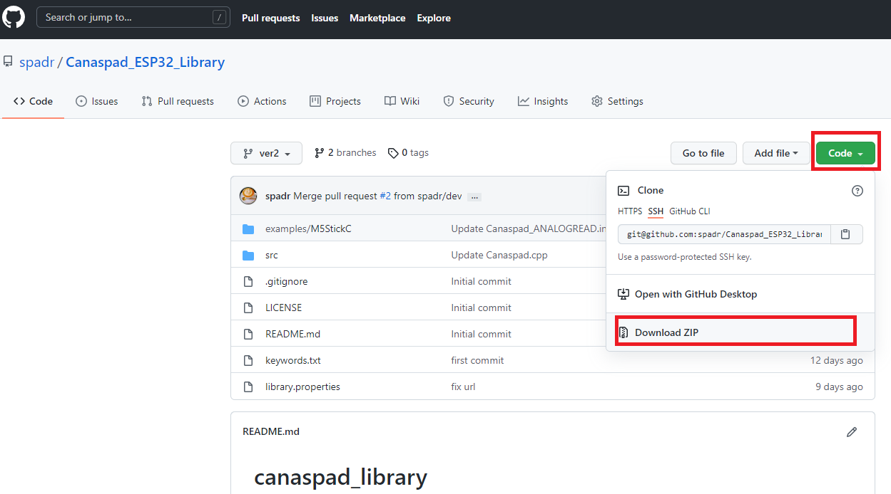
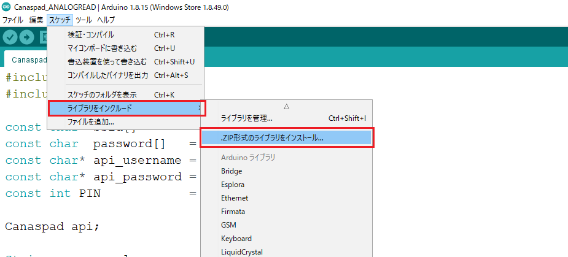

# SDK for Canaspad API


Canaspad is an IoT data analytics infrastructure! You can send and receive data as well as control a microcontroller by installing the SDK in your Arduino IDE and signing up at canaspad.com.

# Architecture

# What is a tube and element?

# Installation
1. Register with your email address and password at canaspad.com
2. Download the library as a ZIP file from this repository.


3. Open the Arduino IDE and install the library.



# Reference

## Canaspad::begin()


### Description

Check the connection to the cloud server.

### Syntax

```arduino
#include “Canaspad.h”
bool Canaspad::begin();
```

### Argument
None
    
### Return value

- bool **true**
    
    Success
    
- bool **false**
    
    Error
    

## Canaspad::set()


### Description

For each channel and series name, a token is generated that identifies where the data will be kept on the server.

### Syntax

```arduino
#include “Canaspad.h”
bool Canaspad::set(String const channel, String const name, Tube &sensor_config);
```

### Argument

- String **channel**
    
    tube channel
    
- String **name**
    
    tube name
    
- Tube **&sensor_config**
    
    tube object
    

### Return value

- bool **true**
    
    Success
    
- bool **false**
    
    Error
    

## Canaspad::write()


### Description

Record sensor readings in microcontroller

### Syntax

```arduino
#include “Canaspad.h”
bool Canaspad::write(struct tm &timeInfo, Tube &sensor_config);
```

### Argument
    
- struct tm **&timeInfo**
    
- Tube **&sensor_config**
    
    tube object

### Return value

- bool **true**
    
    Success
    
- bool **false**
    
    Error
    

## Canaspad::send()


### Description

Send sensor readings stored in the microcontroller to the server.

### Syntax

```arduino
#include “Canaspad.h”
int Canaspad::send(Tube &sensor_config);
```

### Argument

- Tube **&sensor_config**
    
    tube object

### Return value

- uint8_t **HttpCode**
    
    HTTP Status Code

    

## Canaspad::fetch()


### Description

Returns the most recent value from the selected Tube object.

### Syntax

```arduino
#include “Canaspad.h”
void Canaspad::fetch(float *fresh_value, Tube &sensor_config);
void Canaspad::fetch(int *fresh_value, Tube &sensor_config);
void Canaspad::fetch(long *fresh_value, Tube &sensor_config);
void Canaspad::fetch(unsigned int *fresh_value, Tube &sensor_config);
void Canaspad::fetch(unsigned long *fresh_value, Tube &sensor_config);
```

### Argument

- float* **fresh_value**
    
    pointer to variable to be referenced

- Tube **&sensor_config**
    
    tube object
    
    
    

### Return value

None