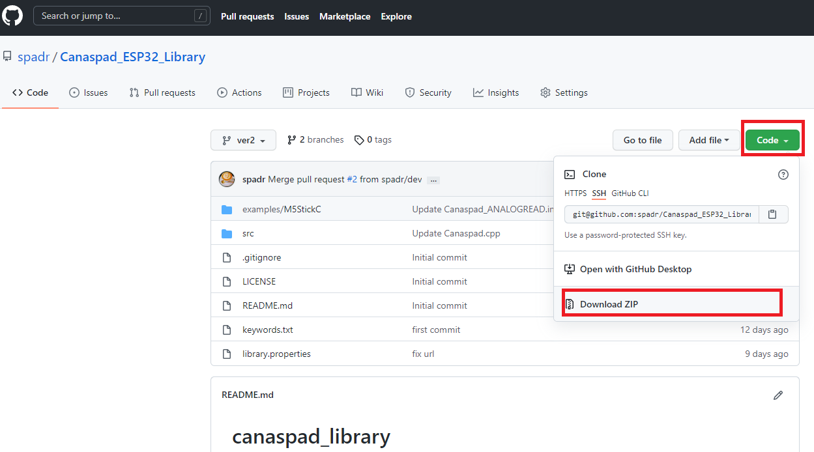
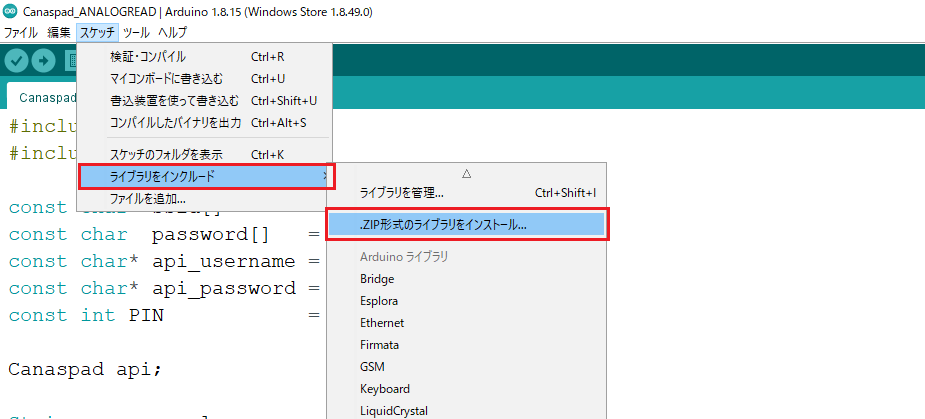

# SDK for Canaspad API


Canaspad is a data analytics infrastructure for IoT! You can install SDK in your Arduino IDE and signup canaspad.com and can send & receive data and control microcontroller.

## Installation
1. Register your email address and password at https://iot.canaspad.com/signup/
2. Download the library from this repository as a ZIP file.


3. Install the library in the Arduino IDE.


## Reference
## Canaspad::domain()

---

### Description

Choose where you want your data to be saved. You do not need to change this option if you use [canaspad.com](http://canaspad.com/).

### Syntax

```arduino
#include “Canaspad.h”
Canaspad::void domain(String domain);
```

### Argument

- String **domain**
    
    ex. “[own.server.com](http://own.server.com/)”  ,  “192.168.10.2”
    

### Return value

- None
    
    

## Canaspad::wifi()

---

### Description

Setup a WiFi access point.

### Syntax

```arduino
#include “Canaspad.h”
Canaspad::void wifi(const char* ssid, const char* password);
```

### Argument

- const char* **ssid**
    
    
    
- const char* **password**
    
    
    

### Return value

- None
    

    

## Canaspad::begin()

---

### Description

Check connection to the cloud server.

### Syntax

```arduino
#include “Canaspad.h”
Canaspad::bool begin(const char* api_username, const char* api_password, int UTC_offset=9);
```

### Argument

- const char* **api_username**
    
    
    
- const char* **api_password**
    
    
    
- int **UTC_offset**=9
    
    Time difference from UTC.
    

### Return value

- bool **true**
    
    Success
    
- bool **false**
    
    Error
    

## Canaspad::set()

---

### Description

The system creates a token that specifies the place on the server where the data will be saved given a channel name and a series name.

### Syntax

```arduino
#include “Canaspad.h”
Canaspad::String set(String device_name, String device_channel, String data_type="number", bool alive_monitoring=false, int alive_monitoring_interval=30);
```

### Argument

- String **device_name**
    
    Data Series Name
    
- String **device_channel**
    
    Data channel name
    
- String **data_type**="number"
    
    Data Type 
    
- bool **alive_monitoring**=false
    
    dead/ alive monitoring on/off.
    
- int **alive_monitoring_interval**=30
    
    How many minutes interval to monitor for dead/ alive.
    

### Return value

- String **device_token**
    
    Token indicating the storage location on the server
    

## Canaspad::add()

---

### Description

Add sensor readings to the microcontroller's database.

### Syntax

```arduino
#include “Canaspad.h”
Canaspad::bool add(String token, float value);
```

### Argument

- String **token**
    
    
- float **value**
    


### Return value

- bool **true**
    
    Success
    
- bool **false**
    
    Error
    

## Canaspad::send()

---

### Description

The data from the microcomputer's database is transferred to the server.

### Syntax

```arduino
#include “Canaspad.h”
Canaspad::String send();
```

### Argument

None

### Return value

- bool **true**
    
    Success
    
- bool **false**
    
    Error
    

## Canaspad::get()

---

### Description

Based on the token, returns the most current value from the provided data series.

### Syntax

```arduino
#include “Canaspad.h”
Canaspad::float get(String token);
```

### Argument

- String **token**
    
    
    

### Return value

- float **value**
    
    
    

## Canaspad::gettime()

---

### Description

The current time is displayed.

### Syntax

```arduino
#include “Canaspad.h”
Canaspad::String gettime();
```

### Argument

- None

### Return value

- String **datetime**
    
    current time
    
    ex. 2022/06/06(Mon)17:25:00
    

## Canaspad::gettimestamp()

---

### Description

The current time is supplied in UNIX time.

### Syntax

```arduino
#include “Canaspad.h”
Canaspad::unsigned long gettimestamp();
```

### Argument

- None

### Return value

- unsigned long **TimeStamp**
    
   