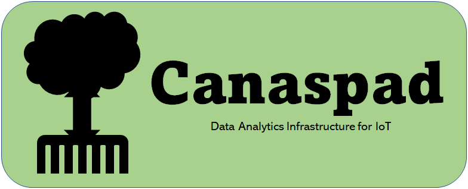

# SDK for Canaspad API


Canaspad is an IoT data analytics infrastructure! You can send and receive data as well as control a microcontroller by installing the SDK in your Arduino IDE and signing up at canaspad.com.

# Architecture

# What is a Tube and Film?

# Installation
1. Register with your email address and password at canaspad.com
2. Download the library as a ZIP file from this repository.


3. Open the Arduino IDE and install the library.


# Reference

## Canaspad::login()


### Description

Login to the Canaspad API.

### Syntax

```arduino
#include “Canaspad.h”
bool Canaspad::login();
```

### Argument
None
    
### Return value

- bool **true**
    
    Success
    
- bool **false**
    
    Error
    

## Canaspad::connect()


### Description

For each channel and series name, a token is generated that identifies where the data will be kept on the server.

### Syntax

```arduino
#include “Canaspad.h”
bool Canaspad::connect(Tube& sensor, String const channel, String const name);
bool Canaspad::connect(Film& sensor, String const channel, String const name);
```

### Argument

- Tube& or Film& **sensor**
    
    Tube or Film object

- String **channel**
    
    channel
    
- String **name**
    
    name
    

### Return value

- bool **true**
    
    Success
    
- bool **false**
    
    Error
    

## Canaspad::write()


### Description

Record sensor readings in microcontroller

### Syntax

```arduino
#include “Canaspad.h”
bool Canaspad::write(Tube& sensor, int year, int month, int day, int hour, int minute, int second, int utc_offset_hour);
bool Canaspad::write(Film& sensor, int year, int month, int day, int hour, int minute, int second, int utc_offset_hour);
```

### Argument
    
- Tube& or Film& **sensor**
    
    Tube or Film object

- int **year**

- int **month**

- int **day**

- int **hour**

- int **minute**

- int **second**

- int **utc_offset_hour**

### Return value

- bool **true**
    
    Success

- bool **false**

    Error


## Canaspad::send()

### Description

Send sensor readings stored in the microcontroller to the server.

### Syntax

```arduino
#include “Canaspad.h”
bool Canaspad::send(Tube& sensor);
bool Canaspad::send(Film& sensor);
```

### Argument

- Tube& or Film& **sensor**
    
    Tube or Film object

### Return value

- bool **true**
    
    Success

- bool **false**

    Error

## Canaspad::fetch()

### Description

Fetch most recent sensor readings from the server.

### Syntax

```arduino
#include “Canaspad.h”
bool Canaspad::fetch(Tube& sensor, float* fresh_value_p, String* fresh_timestamp_p = nullptr);
bool Canaspad::fetch(Tube& sensor, int* fresh_value_p, String* fresh_timestamp_p = nullptr);
bool Canaspad::fetch(Tube& sensor, long* fresh_value_p, String* fresh_timestamp_p = nullptr);
bool Canaspad::fetch(Tube& sensor, unsigned int* fresh_value_p, String* fresh_timestamp_p = nullptr);
bool Canaspad::fetch(Tube& sensor, unsigned long* fresh_value_p, String* fresh_timestamp_p = nullptr);
bool Canaspad::fetch(Film& sensor, uint8_t* fresh_value_p, String* fresh_timestamp_p = nullptr);
```

### Argument

- Tube& or Film& **sensor**
    
    Tube or Film object

- float* or int* or long* or unsigned int* or unsigned long* or uint8_t* **fresh_value_p**

    Pointer to the variable where the value will be stored.

- String* **fresh_timestamp_p**
    
    Pointer to the variable where the timestamp will be stored.

### Return value

- bool **true**
    
    Success

- bool **false**

    Error


